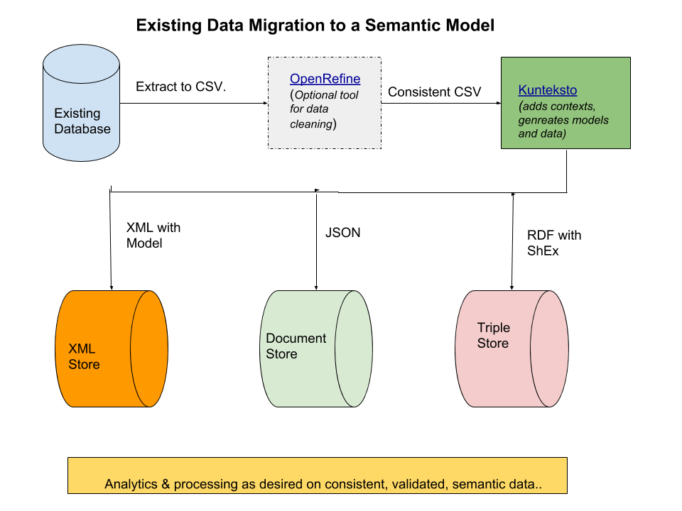

=============================
Introduction and Installation
=============================

Purpose
=======

**S3Model Translator** is a tool to translate simple CSV formatted data files into computable, semantically enhanced knowledge representations. As a foundation for **crowdsourced**, *automated knowledge base construction*; it provides a path for existing data sets to be used in conjunction with the emerging *graph data, model first* approach in analysis, general artificial intelligence (AGI), and decision support systems. This approach opens the door for the change to a more data-centric approach as opposed to the current application-centric approach. This new path enables automatic, machine processable interoperability avoiding the data quality issues created through data migration, data cleaning and data massaging. See :ref:`mlai`

The importance of how this simplifies query and analysis capabilities and improves data quality is discussed in foundational `S3Model <https://s3model.com>`_ documentation and references. However, detailed understanding of S3Model is not required to understand and use the power of the translator.

Target Audience
---------------
The translator design philosophy is based on the ability for *domain experts* from any field, with very little programming ability to quickly annotate data extracts to improve the usability of the data. Data engineers and data scientists can also benefit from the translator in the same ways as domain experts.

The translator can be used in a pipeline to take any existing CSV data sources and create valid XML, JSON documents and RDF triples, that do not lose the context of the source batch/document and adds specific semantics as selected (one time) by the domain expert.

The above diagram shows how data extracts can be converted to rich semantic data. You may or may not need an OpenRefine macro to clean the data. Once a model is defined in the translator, these consistent CSV files are pipelined through to create one or more of the serializations of the data including all of the semantics defined by the domain expert.

.. _install:

Installation
============

Cross-Platform on Anaconda
--------------------------

Anaconda is the **preferred environment** for a tool like the S3Model Translator because it integrates easily with systems for domain experts, data engineers, and data scientists.

- `Download and install <https://www.continuum.io/downloads>`_ Anaconda Python 3.7+ for your platform.
- More detailed Anaconda instructions are `here <https://docs.continuum.io/anaconda/install/>`_  if you prefer.

.. note::
    Anaconda now offers to install the `VS Code editor <https://code.visualstudio.com/download>`_. Unless you already have a preferred text editor, this is a good choice.

- Download the latest release from `GitHub <https://github.com/s3model/S3ModelTranslator/releases>`_.

- Open a terminal window. On Windows it is best to open an *Anaconda Prompt* terminal from the Anaconda menu:

- Unpack the downloaded release archive and change to the directory

.. code-block:: sh

    cd S3ModelTranslator-x.x.x

Where x.x.x is the S3Model Translator release number.

- Create a conda environment for S3Model Translator.

.. code-block:: sh

    conda create -y -n S3MT pycurl ujson

.. _activate: Activate

- Activate the environment according to the **instructions shown by Anaconda in the terminal window**.

Depending upon the options you selected when installing Anaconda:

**Cross Platform**

.. code-block:: sh

    conda activate S3MT

**Windows**

.. code-block:: sh

    activate S3MT

**or Linux/MacOSX**

.. code-block:: sh

    source activate S3MT

- Install S3Model Translator with this command:

.. code-block:: sh

    python setup.py install

.. warning::

    Occassionaly there will be a network timeout when searching for packages to install. The error will show up as a package not being found. Just re-run the installation command to retry.

    You will know when it is complete when you see the message *Finished processing dependencies for translator==x.x.x*

    In extreme timeout cases you may need to run the above installation command several times.

Change to the *S3Model Translator working directory*:

.. code-block:: sh

    cd translator

This is the directory used for all S3Model Translator commands.

The next step is to do the :ref:`tutor`

What are all the files for?
===========================

Depending on how and where you installed S3Model Translator you will see a varying number of files and subdirectories. Many of them may be part of the Anaconda environment, so we do not cover those.

Referenced from the *translator* directory created at install time:

Files
-----

- README.md
    A brief explanation of S3Model Translator's purpose and links to background information.

- LICENSE.txt
    A copy of the copyright notice and license.

- translator.conf
    This file is the required configuration file for S3Model Translator.

Directories
-----------

- example_data
    This directory contains information and sample data files for the tutorials. There is also an example of the completed Demo database, model, and data in the archive Demo_with_semantics.zip.

- s3model
    Support files required for operation.

    - s3model.owl - the core S3Model ontology.
    - s3model_3_1_0.xsd - the reference model schema version 3.1.0
    - s3model_3_1_0.rdf - the extracted semantics from the reference model schema version 3.1.0
    - s3model_3_1_0.xsl - a stylesheet providing visualization in a browser of the reference model schema version 3.1.0
    - dm-description.xsl - a stylesheet that provides for visualization in a browser of any S3Model data model.

