===============
Getting Started
===============

First Steps
===========

Ensure that you have the requirements and have performed the installation as described in the :ref:`install` section for your operating system. Then proceed to the tutorial.

.. _tutor:

Tutorial/Demo
=============

The data and information files for the tutorials are in the S3ModelTranslator subdirectoy *example_data*.
We suggest using your file manager to review the files in this directory.

The primary demo data file is *Demo.csv*.  You will use this file to create your first model and data translation. Below is a screenshot of the entire file as depicted in a spreadsheet application.

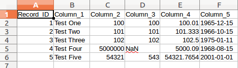

Notice that there are a few columns to demonstrate various datatypes as well as one column with mixed types that might look like an integer column at first glance but has a missing value.

This tutorial does not demonstrate all of the functionality of S3Model Translator, but it does demonstrate the process of creating a model based on data and then enhancing that data with improved semantics.

S3Model Translator is a tool that uses a combination of command line options, web browser UI as well as a configuration file. This functionality is built on the `Flask <http://flask.pocoo.org/docs/1.0/>`_ framework.
The configuration file options are covered in :ref:`config`. The default configuration is okay for the tutorials.

.. _tutorsteps:

Tutorial Steps
==============

- Navigate to the *translator* subdirectory of the directory where you installed S3Model Translator.

- Example: ~/S3ModelTranslator-1.0.2/translator

- With the virtual environment active.

.. caution::

    If you closed and reopened a new window, then you need to activate the environment again. Also, be certain that you are in the translator directory.

    .. code-block:: sh

        conda activate S3MT

The first step is to start the local web server from the *translator* directory.

**Windows**

.. code-block:: sh

    translator.bat

**or Linux/MacOSX**

.. code-block:: sh

    ./translator.sh

You should see messages similar to this:

.. code-block:: sh

    * Serving Flask app "translator" (lazy loading)
    * Environment: development
    * Debug mode: on
    * Running on http://127.0.0.1:7659/ (Press CTRL+C to quit)
    * Restarting with stat

    S3Model Translator version: 1.0.2 using S3Model RM: 3.1.0

    * Debugger is active!
    * Debugger PIN: 956-048-520

In your web browser open the link: http://127.0.0.1:7659/

This will open the Home/Overview of the application.

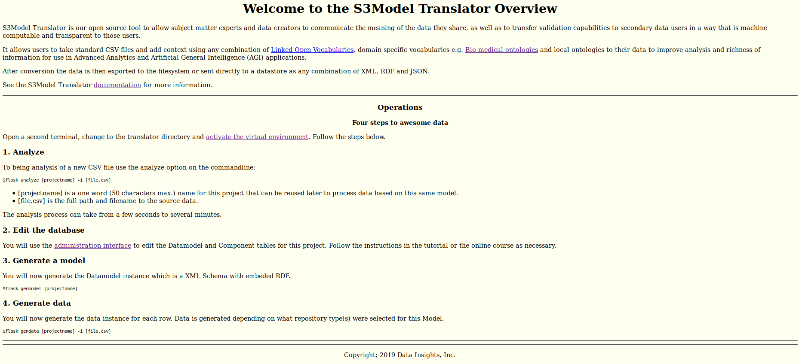

This page presents some basic information as well as operational instructions. For now you may continue with this tutorial. However, there is important information about using the translator when you begin to process your own data files.

**Open a second terminal window/tab and navigate to the translator directory. Then activate the virtual environment as you did previously in the other terminal window.**

Before we begin using S3Model Translator to improve our data, we are going to load some examples into the database.

.. code-block:: sh

    flask ldexamples

We will discuss these examples later in the tutorial.

As shown on the home page there are four steps.

- The first is to analyze the data file.

.. code-block:: sh

  flask analyze Demo -i ../example_data/Demo.csv

This command tells the Flask framework to run the analyze command with a project name of *Demo* and the input data file Demo.csv from the example_data directory.

You can also change the delimiter used in the data file as well as perform a *simple* analysis that doesn't do datatype checking. For details on using those options check the --*help*

.. code-block:: sh

    flask analyze --help

- Edit the database.

In your browser click the `administrative link <http://127.0.0.1:7659/admin>`_ shown on the homepage or add */admin* to the URL in your browser.

From the menu across the top, click the *Data Models* link.

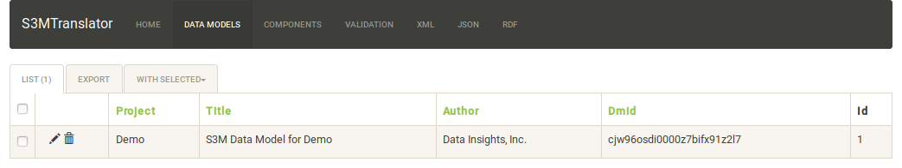

Click on the pencil icon on the left next to the *Demo* project.

The two images below depict the view of the Model Metadata form. The shaded boxes are read-only. All others may be edited as desired. See the field descriptions below.

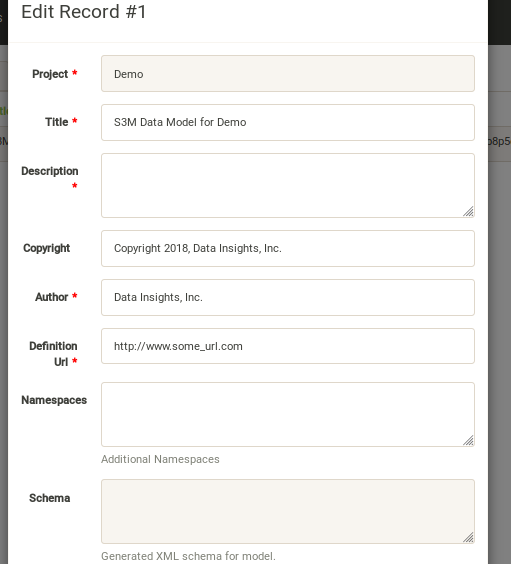

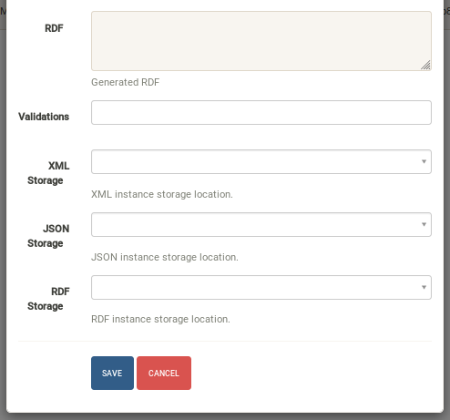

**Data Model table field descriptions:**

    - *Project* is a unique name provided at analysis time. (read only)
    - *Title* is a free text, descriptive title for the data concept(s) contained in the CSV file.
    - *Description* is a free text, elaborated description of the data contained in the CSV file.
    - *Copyright* enter the name of the copyright holder of the model
    - *Author* enter the name of the author of the model
    - *Definition URL* enter a URL (or at least a URI) to a controlled vocabulary or ontology or a webpage that describes or defines the overall concept of the data model.
    - *Namespaces* additional namespaces used in this Project that are not already defined by S3Model Translator. (see below)
    - *Schema* the XML Schema that will be generated later. (read only)
    - *RDF* the RDF triples that will be generated later. (read only)
    - *Validations* validation logs created during data generation.
    - *XML Storage* a storage location for generated XML data instances. If left blank, XML will not be persisted.
    - *JSON Storage* a storage location for generated JSON data instances. If left blank, JSON will not be persisted.
    - *RDF Storage* a storage location for generated RDF data instances. If left blank, RDF will not be persisted.

.. note::

   With your file manager, navigate to the *S3ModelTranslator-x.x.x/example_data* subdirectory and open the *S3MT_Demo_info.pdf* file. This file simulates what often purports to be a data dictionary that you might receive with a dataset. Using information from this document improves the computable semantics of your data.

Edit these fields as desired. They describe the overall metadata for your data model. This metadata describes the where, when and why the data is useful to the model. Note that the fields marked with a red asterisk are required.

Notice that some of this information can be obtained from the PDF. For other items, you have to use your knowledge of the dataset as a domain expert. In this *demo* we are going to say that we have a local ontology that describes the columns and that information is provided below in the *Adding Semantics* section below.
The *Description* and *Definition URL* are also in the PDF. The tutorial is purposefully vague so that you will experience the tasks of finding appropriate information for the data.

Before we began the analysis step, recall that earlier we loaded some examples with the **ldexamples** command. These examples are storage definitions. At this point, go ahead and select the *Filesystem* option for each of the XML, JSON and RDF storage locations.

**Click the blue SAVE button**

- Now we will edit each of the model components. Click on the *Components* entry in the top menu.

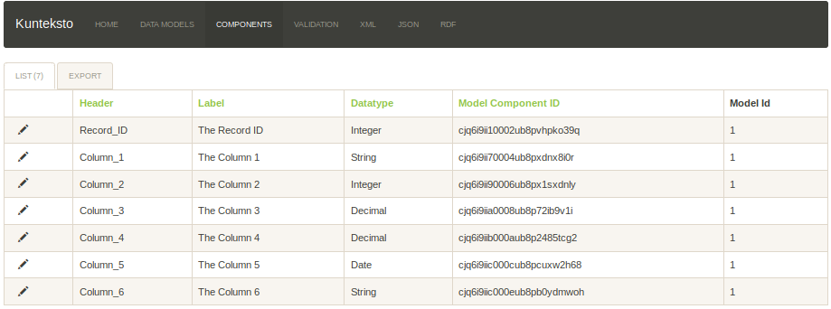

.. note::

    The Model Component IDs in your Demo model will be different than those shown.

Each of the columns from the CSV file are now represented by a record in the Components table. The Header field is the actual column header from the CSV file. The Label field is a modified form of that header. You will edit this field to provide something meaningful about the data in the column. The Datatype field is S3Model Translator's best guess at the correct type. It is up to you to be as accurate as possible in describing your data to improve quality and usability. Some fields are not used with all data types. Click on the pencil icon next to each record. See the description of each field below.

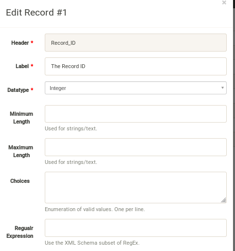

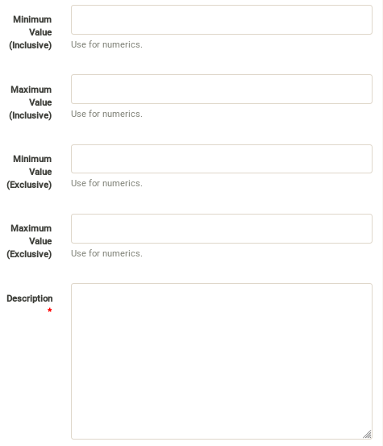

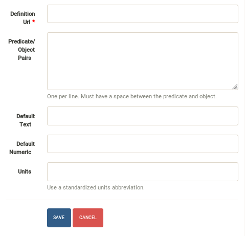

**Record field descriptions:**

Edit these columns (see :ref:`semantics`) :

    - *Header* the column header from the input CSV file. (read only)

    - *Label* was derived from the column header text and should be edited as needed to provide a more meaningful name for the column.

    - *Datatype* the analyzer attempts to guess the correct datatype for the column. You must select the correct type; String, Integer, Decimal, Date, Time or Datetime from the pulldown.

    - *Minimum Length* for **String** columns enter the minimum length restriction if there is one.

    - *Maximum Length* for **String** columns enter the maximum length restriction if there is one.

    - *Choices* for **String** columns you may enter a set of choices to restrict the valid values. Separate each choice with a new line.

    - *Regular Expression* for **String** columns you may enter a regular expression (`XML Schema syntax <http://www.xmlschemareference.com/regularExpression.html>`_) to constrain the valid string values.

        .. warning::

            The decimal separator throughout S3Model Translator is a period, do not use a comma. Do not use a thousands separators.
            Also, if you mix the use of min/max inclusive or exclusive in an illogical manner, the system takes the inclusive value(s) and will
            ignore the exclusive value.

    - *Minimum Inclusive Value* enter the minimum inclusive value restriction for **Integer or Decimal** columns.

    - *Maximum Inclusive Value* enter the maximum inclusive value restriction for **Integer or Decimal** columns.

    - *Minimum Exclusive Value* enter the minimum exclusive value restriction for **Integer or Decimal** columns.

    - *Maximum Exclusive Value* enter the maximum exclusive value restriction for **Integer or Decimal** columns.

    - *Description* for all columns enter a textual description that might be used for human-readable documentation.

    - *Definition URL* enter a URL (or at least a URI) to a controlled vocabulary or ontology or a webpage that describes or defines the meaning of the data in this column.

    - *Predicates & Objects* optionally enter any additional *predicate object* pairs to be used to define this resource. Enter them one per line with the predicate and object separated by a space character.

        .. warning::
            You may use namespace abbreviations **ONLY** if they are in the list below or have been defined in the **Namespaces** field of the model metadata form. To do otherwise generates an invalid model and will generate errors.

    - *Default Text Value* for **String** columns enter the default value for a string datatype column if there is one.

    - *Default Numeric Value* enter the default value for a decimal or integer datatype column, if there is one.

    - *Units* **mandatory** value for all **Decimal or Integer** datatype columns. For decimal columns, this should come from a standard units vocabulary such as `Ontology of units of Measure <https://github.com/HajoRijgersberg/OM>`_ or `The Unified Code for Units of Measure <http://unitsofmeasure.org>`_. For Integer columns where the values are *counts* you should enter the name of the item(s) to be counted. For example, if this number represents the number of widgets created today. Then enter "Widgets* here.

.. _semantics:

Adding Semantics
----------------

.. note::

   If not already open; with your FileManager navigate to the *S3ModelTranslator-x.x.x/example_data* subdirectory and open the *S3MT_Demo_info.pdf* file. This file simulates what often purports to be a data dictionary that you might receive with a dataset. You use this information to improve the computable semantics of your data.

Editing the fields in this listing improves the semantics in your model that describes the data. This information allows your data consumers to make better decisions about what the data means. S3Model Translator produces an executable model and data components that can be used in various validation and knowledge discovery scenarios.

In the **Data Model** form you should change the fields as you wish to match your organization. The field *Definition URL* is where we point to the overarching definition of this datamodel. This URL is used as the *object* portion of a RDF triple where the *subject* is the unique datamodel ID (dm-{uuid}) and the *predicate* is **rdfs:isDefinedBy**. We see in our *S3MT_Demo_info.pdf* file that it is declared to exist at https://www.datainsights.tech/S3MT_Demo_info.pdf  so this is our URL for this field.

In the **Components**, the *Definition URL* and *Predicates & Objects* are where we add semantics for the generated RDF format. The *Definition URL* is formatted the same as for the *Defining URL* column in the Model.

The *Predicates & Objects* column is slightly different in that you need to supply both the predicate and the object.

.. note::

    S3Model Translator defines these namespace abbreviations:

    - vc="http://www.w3.org/2007/XMLSchema-versioning"
    - xsi="http://www.w3.org/2001/XMLSchema-instance"
    - rdfs="http://www.w3.org/2000/01/rdf-schema#"
    - rdf="http://www.w3.org/1999/02/22-rdf-syntax-ns#"
    - owl="http://www.w3.org/2002/07/owl#"
    - xs="http://www.w3.org/2001/XMLSchema"
    - xsd="http://www.w3.org/2001/XMLSchema#"
    - dc="http://purl.org/dc/elements/1.1/"
    - dct="http://purl.org/dc/terms/"
    - skos="http://www.w3.org/2004/02/skos/core#"
    - foaf="http://xmlns.com/foaf/0.1/"
    - schema="http://schema.org/"
    - sioc="http://rdfs.org/sioc/ns#"
    - sh="http://www.w3.org/ns/shacl#"
    - s3m="https://www.s3model.com/ns/s3m/"

For example, if you want to define an alternate label in addition to the Label field, you could use the SKOS *skos:altLabel* predicate. However, if you want to use the predicate *isSettingFor* from the `Information Objects ontology <http://www.ontologydesignpatterns.org/ont/dul/IOLite.owl>`_ then you would need to first define an abbreviation for this ontology in the Namespaces field of the Model.

.. warning::

    The field is an open text field so you must use care in making your entries here.  Each predicate/object pair is entered on one line with a space between the predicate and object. For example:

.. code-block:: sh

     skos:altLabel Blue Spot

     dul:isSettingFor https://www.datainsights.tech/thingies/PurpleKnob

The *object* portion can contain spaces. However, the first space character defines the separation between the *predicate* and *object*.

Again, the information in the table in the PDF can help you determine additional meaning about the data if you are not a domain expert in this area of *Fake System* information. If you do not already have an ontology defining the meaning of these columns then you can search in places like `BARTOC <http://www.bartoc.org/>`_,
`Linked Open Vocabularies <http://lov.okfn.org/dataset/lov>`_ and `Biontology <https://www.bioontology.org/>`_
or even places that aren't formal ontologies but contain reliable definitions and descriptions such as
`a dictionary <http://www.dictionary.com/>`_ or an `encyclopedia <https://en.wikipedia.org/wiki/Main_Page>`_.

Some examples of the completed components are shown below.

Here you can see that each of them have new *labels* taken from the PDF.

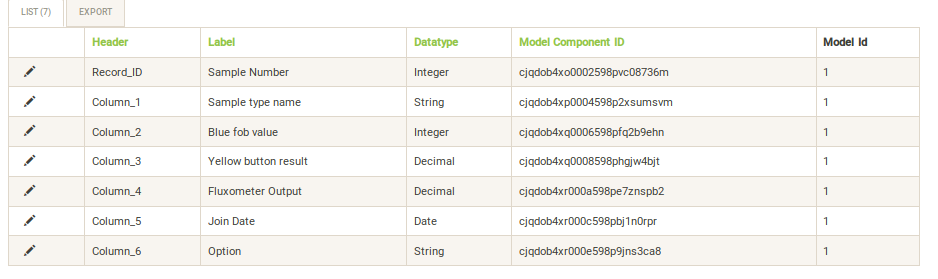

Below you can see completed portions of Column_3.

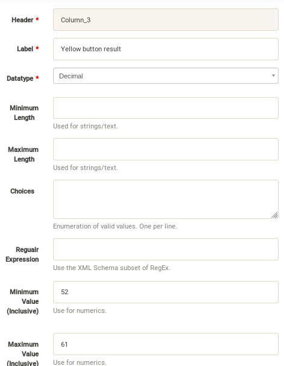

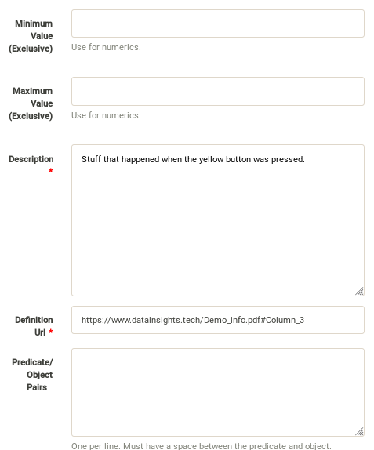

You can see that the decimal constraints have been applied.

In the completed Column_6 below you can see the Options are the description as well as specified as the choices constraint.

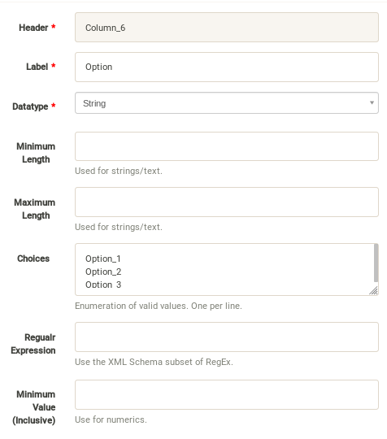

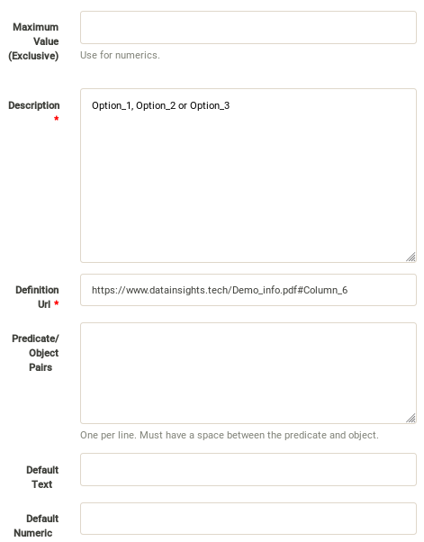

Once you have completed the data description step, **saved your changes** using the *Save* button on each Component record, then you may execute the model generation process.

- In your terminal window generate the model with this command:

.. code-block:: sh

    flask genmodel Demo

The command above tells the Flask framework to execute the genmodel function with the project named *Demo*. You should see terminal output similar to this image:

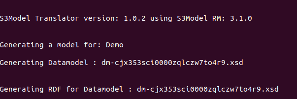

Open the *Data Models* menu option for the Demo project and check the Schema and RDF fields:

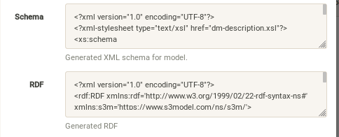

The two fields now contain the generated XML Schema and the RDF triples for the model. You can copy these and paste them into an editor if you wish to examine them. Later we will cover how to export these for sharing with secondary data users. These are the structural and semantic models that can be used in your analysis as well as shared with others to describe the data better. The RDF file is extracted from the XML Schema, so only the schema needs to be shared to distribute full structural and semantic information in an executable model. Data Insights, Inc. provides a utility with `S3Model <https://datainsights.tech/>`_ to extract the semantics from the schema data models.

- The *gendata* command causes the creation of data instances (XML, JSON, and RDF) for each record in the CSV file that is semantically compliant with the RDF and is valid according to the XML Schema. This validation process demonstrates that the models, do indeed, describe the data.

- The RDF file does include some constraint definitions based on `Shapes Constraint Language (SHACL) <https://www.w3.org/TR/shacl/>`_ There is no built-in processing for these constraints due to the lack of maturity of this technology. Expect SHACL to become more useful in the future. To create the data instances and persist them at the locations defined by the Storage options in the model definition, execute this command in the terminal:

.. code-block:: sh

    flask gendata Demo -i ../example_data/Demo.csv

The output in the terminal should be similar to this image:

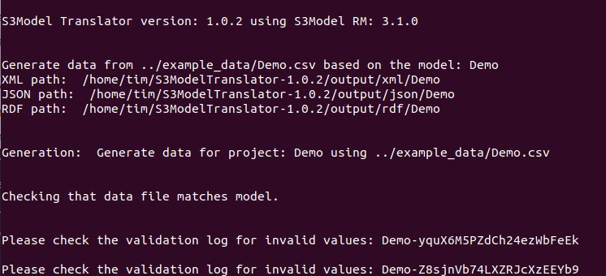

The storage options that we selected for the Demo project was a Filesystem storage for each of the three types(XML, JSON & RDF) of data instances. In this case the options placed the data in a S3Model Translator subdirectory called *output*. One subdirectory for each type of data. Inside this directory, S3Model Translator creates a Project based subdirectory. Using your FileManager navigate to the directories and notice the generated data instances:

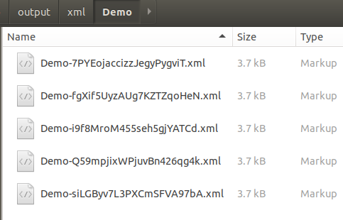

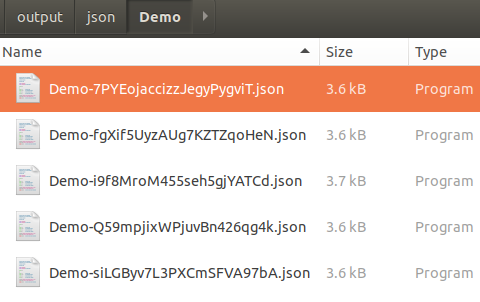

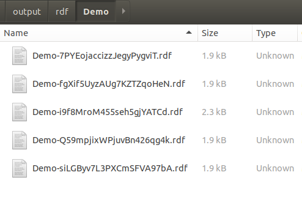

Notice that each data instance file has the name; the project name follwed by a unique ID. The data instance has the same name across formats with only the file extension being different.

Data Validation
===============

In the output from data generation there was a message to review the validation log. Go to the *Validation* menu and click on the pencil icon for the generated validation record.

Full validation occurs via XML for both the data model and data instances. Failing to select a storage for XML does not prevent this validation; it only prevents persistence of the XML files.

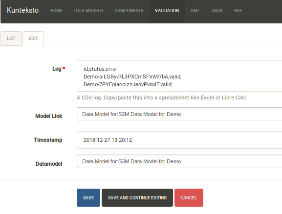

The Log field contains a CSV output log of the validation process. You can copy/paste this into a spreadsheet or text editor for examination.

.. note::

    Your validation log will look like this with different Demo-{cuid} filenames.

    .. code-block:: text

        id,status,error
        Demo-CMbmzjE5xCFjSG4yrVhbL7,valid,,
        Demo-AuPKLN97aGQZHUA6K6NZvn,valid,,
        Demo-NfHYtqK5ZKg5NQNK5pwxxj,valid,,
        Demo-WSmPQb9BNixJGLsCTNCVF2,invalid,Element 'xdquantity-value': 'NaN' is not a valid value of the local atomic type.,
        Demo-NSeunBttQwjXF36UZDs5AM,valid,,

Notice that one file is flagged as invalid and the reason is given in the *error* column. The invalid record is due to a 'NaN' entry in a decimal column.

.. note::

    In the XML eco-system, a catalog file is required to reference a local copy of a schema used for validation. A catalog file is dynamically generated for each installation of S3Model Translator and is written to the *S3ModelTranslator-x.x.x/catalogs* directory. The environment variable **XML_CATALOG_FILES** is set by S3Model Translator to be used by the `lxml <http://lxml.de/>`_ validator to find the generated *Data Model* schema.

    Read more about `XML catalogs here <https://en.wikipedia.org/wiki/XML_catalog>`_.

In addition to the entry in the log file. S3Model Translator also inserts an *ExceptionalValue* element in the XML file.
The filename is listed in the validation log. Check that file and you will see an *Invalid* entry along with an XML comment containing an error message. Note that the JSON converter strips the error message but the Invalid exceptional value element is still present.

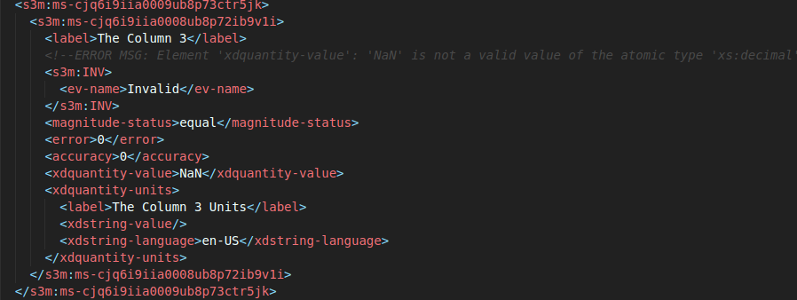

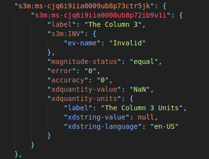

.. note::

    The S3Model eco-system has a much more sophisticated ability to handle missing and erroneous data.
    The details are available in the `S3Model documentation <https://datainsights.tech/S3Model/>`_. To use this expanded *ExceptionalValue* tagging generally requires the model first approach whereas S3Model Translator is an after-the-fact bridge.

Notice that S3Model Translator has inserted a human readable comment with the error message from the schema validator.

S3Model Translator has also inserted the machine processable `ExceptionalValue child named **Invalid** <https://datainsights.tech/S3Model/rm/s3model_3_1_0_xsd_Complex_Type_s3m_INVType.html#INVType>`_
from the `S3Model Reference Model <https://datainsights.tech/S3Model/rm/index.html>`_.

*To review the details of the s3m:INV element, use right-click and open those two links in a new tab.*

This invalid status is also represented in the RDF as shown here:

.. code-block:: xml

  <rdfs:Class rdf:about="Demo-WSmPQb9BNixJGLsCTNCVF2/s3m:dm-cji07wnil000ei7l3xpbvzsul/s3m:ms-cji07wnil000gi7l3b3qxbi6g/s3m:ms-cji07wngr0007i7l3b2icvkm0/s3m:ms-cji07wngr0006i7l3ey0pdbx7/xdquantity-value">
    <rdfs:comment>"Element 'xdquantity-value': 'NaN' is not a valid value of the local atomic type."</rdfs:comment>
  </rdfs:Class>

  <rdfs:Class rdf:about="Demo-WSmPQb9BNixJGLsCTNCVF2">
    <rdf:type rdf:resource="https://www.s3model.com/ns/s3m/s3model/DataInstanceInvalid"/>
  </rdfs:Class>

Shown above are two *Subject, Predicate, Object* RDF triples in the canonical RDF/XML syntax.

  - In the first triple, the full path to the invalid element is the subject and a comment is asserted containing the error message.

  - In the second triple, the file is declared as an invalid data instance in accordance with the
    `S3Model ontology <http://datainsights.tech/S3Model/owl/>`_ *Opening the link in a new tab is suggested*.

It is important to note that the semantics from the data model schema are extracted into a RDF/XML file also located in the *S3ModelTranslator-x.x.x/output/rdf/Demo* directory. In the :ref:`advtutor` you will see how these semantics interact with the Reference Model semantic graph.

The downstream processing tools can then use this invalid status as needed; depending on the data analysis/usage situation. This expanded information allows downstream users to make more informed decisions about the usefulness of the data in their context.

Additional Steps
----------------

In real-world situations, we often generate data on a continuing basis for this same data model. To demonstrate this functionality, use the Demo2.csv file. From the command line issue this command:

.. code-block:: sh

    flask gendata Demo -i ../example_data/Demo2.csv

This command entry says to use the *Demo2.csv* file with the **gendata** command to reuse the *Demo* project model. A new validation log is generated and two files are shown as invalid. You should review this log an be sure you understand the implications of the processes covered so far.

There will be 10 files in each of the output locations. Five from Demo.csv and five from Demo2.csv.

It is important to realize that the CSV files must represent **EXACTLY** the same type of data to reuse the project model information and the generated schema. If you issue this on the command line:

.. code-block:: sh

    flask gendata Demo -i ../example_data/Demo3.csv

You will see this error message:

.. code-block:: sh

    There was an error matching the data input file to the selected model database.
    The Datafile contains a header label, Bad_Column_name that does not match the Component headers.

This is because Demo3.csv has a column that is different in name from what is expected in the model.
Therefore, no new data files were generated because the input file does not match the model.

Using this rich data
====================

Now that we have all these files, what can we do with them?

In the :ref:`config` section you learn about automatically placing your data into appropriate databases/repositories for further usage. If yours is not yet supported, you can use the filesystem and then manually import the data. Of course, you can also contribute support for new data repositories, see :ref:`develop`.

To exploit the richness of the RDF data, you load these files into your RDF repository:

- s3model/s3model.owl
- s3model/s3model_3_1_0.rdf

As well as the generated data and the model RDF.

The model schema and RDF can be exported using this command:

.. code-block:: sh

    flask export Demo

Where *Demo* is the project name you want to export. The files will be located in a subdirectory, named for the project, of the *dmlib* directory.

In your XML DB or the appropriate place in your data pipeline, you will want to use the dm-{uuid}.xsd data model schema to validate your XML data. You should be using XML Catalog files, and an example is created for each project in the *catalogs* directory.

Your JSON data instances can be used as desired on the filesystem or in a document DB.

.. _mlai:

Machine Learning & AI
=====================

There is a growing effort to expand the current data science algorithms to exploit richer data formats such as RDF.

Some references to get you started:

- `The Power of Machine Learning and Graphs <https://www.youtube.com/watch?v=feGvnBNwLwY&>`_ (video).
- `Knowledge Graphs for a Connected World - AI, Deep & Machine Learning Meetup <https://www.youtube.com/watch?v=PAumnCRZuMY&>`_ (video).
- `Knowledge Graphs Webinar <https://youtu.be/cjxzBmpBq5Q?t=25m28s>`_  (video).
- `Towards Analytics on Top of Big RDF Data <https://www.youtube.com/watch?v=VoEEb_oGN7w>`_ (video).
- `Linked Data meets Data Science <https://ablvienna.wordpress.com/2014/10/28/linked-data-meets-data-science/>`_
- `RDF on KDNuggets <http://www.kdnuggets.com/tag/rdf>`_
- `RDF on Data Science Central <http://www.datasciencecentral.com/profiles/blog/list?tag=RDF>`_

Search on YouTube or use your favorite search engine with keywords *Semantic Graph Analytics Machine Learning*
for more up to date references.

You can also find many tools on the web for converting your CSV data into RDF.

What you **will not** find is a tool similar to S3Model Translator for converting your plain old data into rich, semantic graph RDF **with data validation based on a validated model**. No one else tells you how difficult it is to get good, *clean data* into your graph. Remember that **Garbage in == garbage out**.

Why multiple copies of the same data?
-------------------------------------

You can choose which types to create in the model definition. However, each one has different qualities.
For example, the XML data is the most robust as far as any data quality validation is concerned.
The RDF is more useful for exploration and knowledge discovery, and the JSON is simpler to use in some environments.

More Information
----------------

To gain a better understanding of the capability of S3Model Translator, you should also perform the :ref:`advtutor`.
These tutorials demonstrate the power of S3Model using persistent storage.

